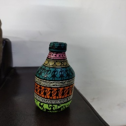
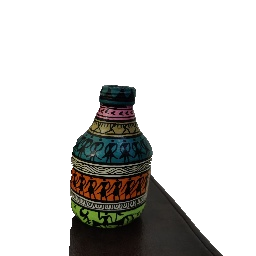
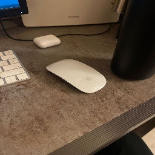

# Stickify - Create stickers from images

The problem that we have chosen is using saliency detection to detect foreground objects in images and creating stickers with transparent background out of these images.

## Motivation
The motivation behind choosing this particular problem statement has come from a real life problem we faced recently. With the COVID pandemic and work from home, almost every submission we have to make and every quiz we have to give involves creating a detailed report, often including complex diagrams / doodles for the purpose of explaining our point. Hand drawn diagrams are often very difficult to include in a report. The whole process of clicking an image from a mobile device, sending the image to a computer through mail, and then copy-pasting it onto the diagram seems like too much work for a seemingly trivial task. 

Inspired by the problem described above, our initial idea was to develop an AR Scan-n-Paste tool which allows a user to point the mobile’s camera to an object, and point it towards an online document (a Word file or a Google doc) and the object would be directly pasted onto the said document. Building this solution involved a lot of effort in areas other than Computer Vision, so we condensed this problem to detecting the most salient object in an image and then making all the background in the image transparent so as to obtain results similar to the ones shown above. This way, our approach is not limited to just hand drawn diagrams and will work generically on any image, given that it actually does contain a prominent object.

## Input and Output
The input would be a .jpg image and the output would be a .png image, containing only the primary object in the image on a transparent background. A sample input and output is shown below for reference.

## Notebooks
We have tried out six different variants i.e. v1 - v6, each having a different jupyter notebook. The details of each of the versions can be found in the project report [add_link_to_project_report]

## Dataset
The dataset we used was the DUTS dataset. It is currently the largest saliency detection dataset and comprises two subsets: DUTS-TR and DUTS-TE. DUTS-TR contains 10553 images designed for training and DUTS-TE has 5019 images for testing. The Dataset has been uploaded on google drive [add_link_to_google_drive]

## Visualisations

\

\

\

\
